# Block Aligner: an adaptive SIMD-accelerated aligner for sequences and position-specific scoring matrices

- SIMD: single instruction multiple data

## Introduction

### Alignment

- 目標：分析檢體的 DNA
- 做法：將檢體的 DNA 片段（reads）與 reference genome 做比較，就可以得知每個 read 位於何處
- 難處：定序錯誤、基因可能含有變異的資料
- 問題轉換：有容錯功能的字串搜索
- 新的問題：如何表示兩個序列的「相似程度」

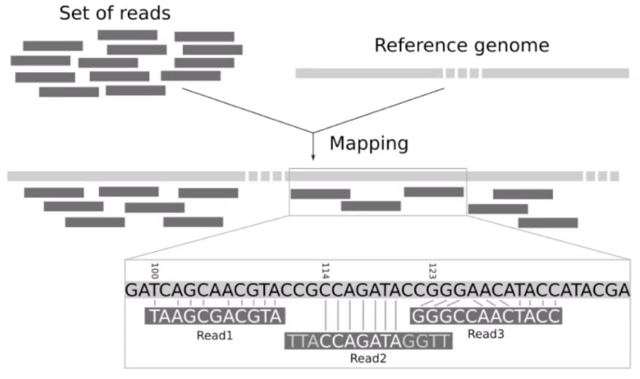

### Hamming Distance

- 原理：直接比較兩個字串中，每個字元是否相同
- 問題
    - 兩個字串需要一樣長
    - 無法處理插入或刪除的差異
    - 無法處理位移的關係

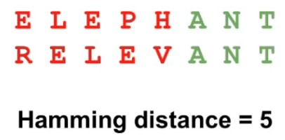

### Edit Distance

- 類似 LCS 的演算法（DP）

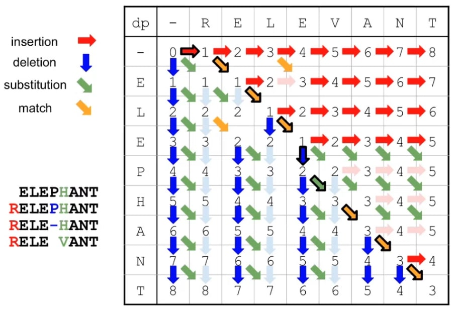

### Needleman-Wunsch

- 將 edit distance 加上權重，使不同情況的差異有不同的分數，可依照情況出現的機率調整權重參數
- 原因：有些情況較少出現

### Linear / Affine Gap Penalty

- Linear：直接將差異乘以權重
- Affine：依照 gap 是否為連續，計算出不同的分數
- 原因：非連續缺失的情況在事實上表示演化距離較遠

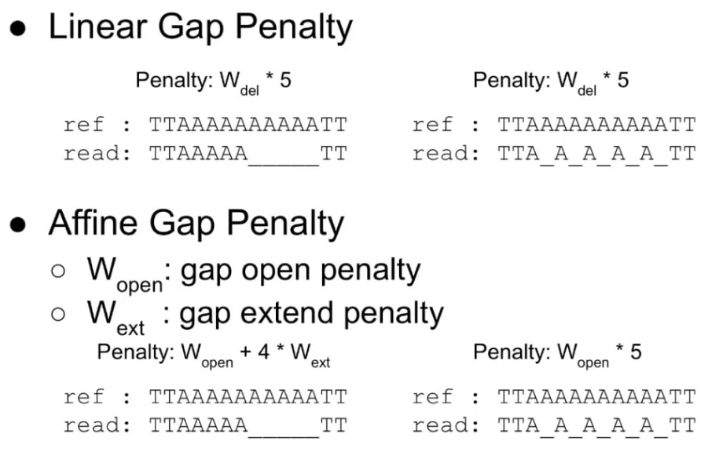

## Related Work

### Banded

- 通常在 gap 很小的情況，DP 路徑只會在對角線附近，因此只需要在對角線附近進行計算

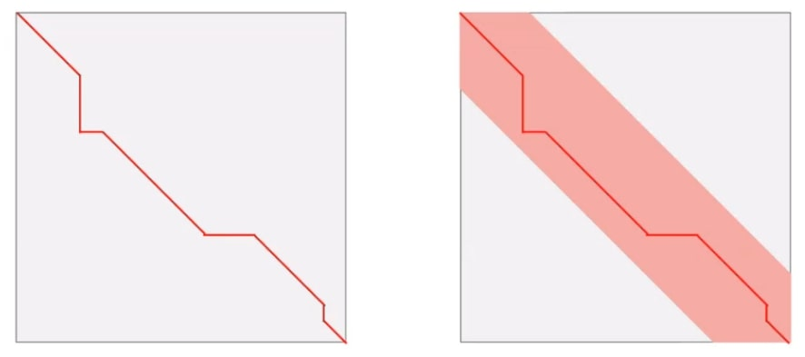

- 缺點：萬一 gap 很大會導致 DP 路徑超出設定的 banded 範圍，使得計算出來的結果為非最佳解
- 單純增加 banded 的範圍雖然能解決問題，但會使計算量增加，增加到過寬也就等同於沒有優化問題

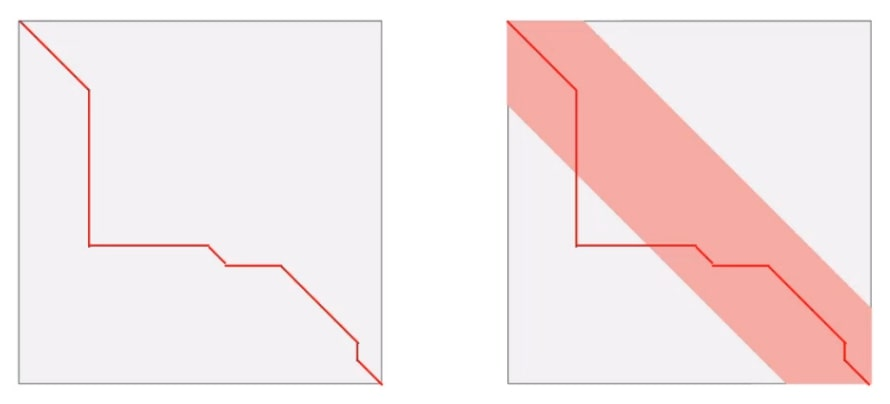

### Adaptive Banded

> 如：KSW

- 將 banded 的範圍隨著計算的途中動態調整 banded 的方向，但寬度依舊不變

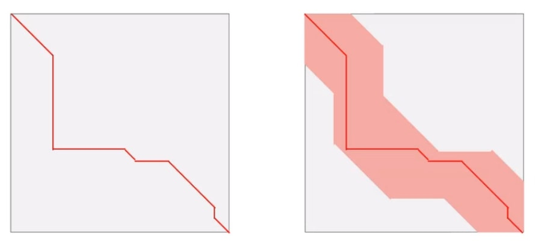

### Wavefront

[🎥 The graph wavefront algorithm](https://www.youtube.com/watch?v=ycS2oNUpt0g)

- 只計算比當前最大距離小的部分（下圖右），而非整個 DP 表格（下圖左）
- 時間複雜度可由 $O(N^2)$ 優化為 $O(DN)$，其中 $D$ 為最大距離，也就是說兩個序列距離越小就算越快
- 有點類似從左上角灌水的概念，而距離越大代表海拔高度越高，還沒被水淹到的就不用計算

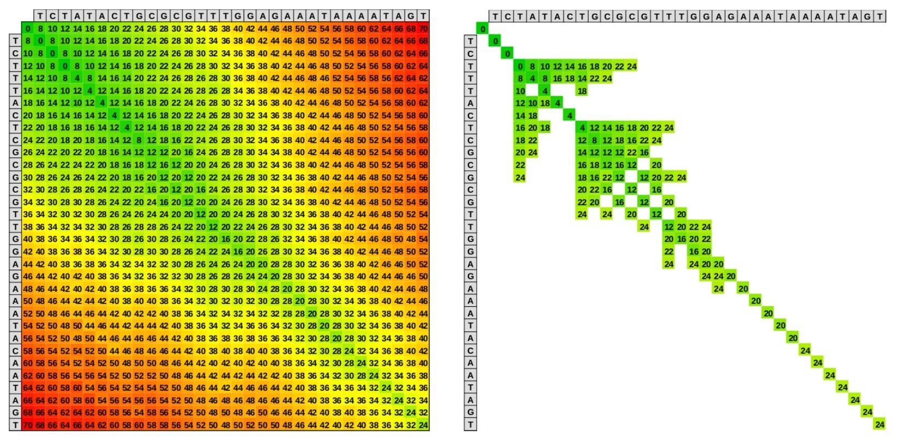

- 大致作法
    - 運算過程中，記錄每條斜線 $\searrow$ 目前計算到最遠的位置（下圖）
    - index 可使用行列差（下圖左上的 array）

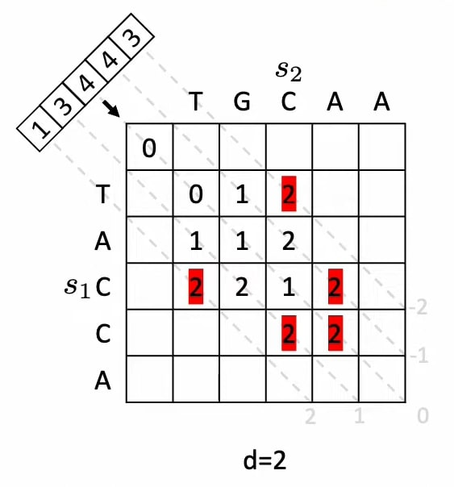

## Methods

- 備註：
    - 此處的分數越高表示越相似，而非上面提到的懲罰分數
    - 格子範圍的最大和最小有參數限制著

### Block Shift

- 分為 $\downarrow$ 和 $\rightarrow$ 兩種方向
- 會依照目前的範圍，新增該方向 $k$ 排的計算
- 判斷往哪邊出現的分數會比較高，就往該方向進行計算
- 此處有運用 SIMD 的技術稍微提升性能
    - 將一排分成好幾組，每組平行運算 $\searrow$ 與 $\downarrow$ 兩個方向
    - 若組間發現可以改進，就更新後重新計算
    - 分析：若有組間不需改進則有減少運算時間

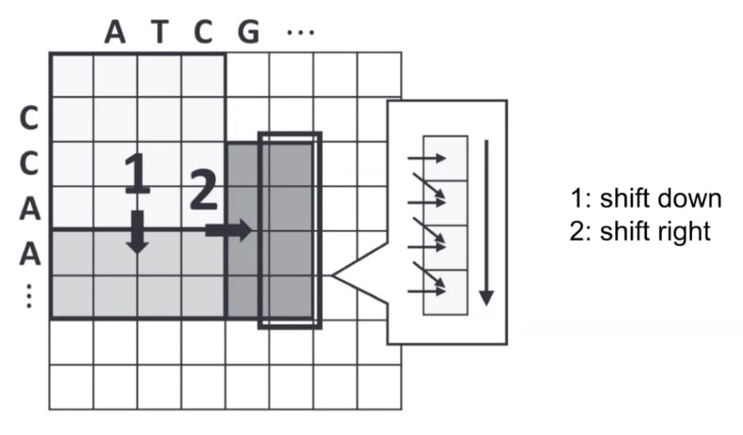

### Block Shrink

- 若最高分的格子集中在右下角，就會將整體縮小到剩下右下角 $\dfrac{1}{4}$

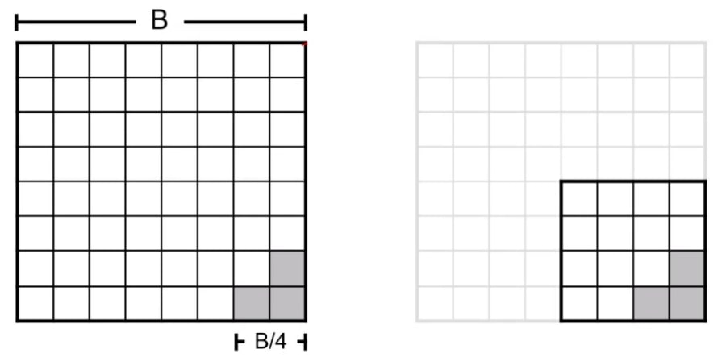

### Block Growing

- 若做了幾個步驟之後發現整體分數並沒有增加，表示可能先前的格子大小不夠，因此會回到之前的某個 checkpoint 進行放大後重新計算

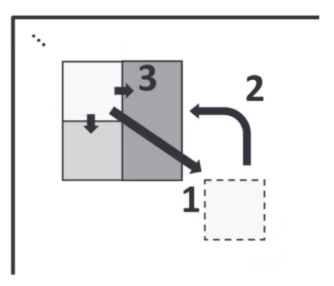

### Overview

> 整體流程

1. 檢查是否能夠縮小範圍，若可以就縮小
2. 檢查是否有需要放大範圍，若需要就放大並回到先前的位置
3. 決定要往下還是往右擴增計算

## Results

### Dataset

- Illumina reads
    - 錯誤率低的短序列
    - 101 bp
- 分成不同層級的 ONT reads
    - 錯誤率高的長序列
    - 分為 1 kbp、< 10 kbp、< 50 kbp 三組
    - sequence identity 約為 90%，計算方式：$\text{seq id} = \dfrac{\text{\#matches}}{\text{\#matches} +
      \text{\#mismatches} + \text{\#insertions} + \text{\#deletions}}$
      > 指在兩個或多個生物分子序列中，具有相同核苷酸或氨基酸的位置比例
- protein dataset: Uniclust30
    - 基本上比長序列短（20 ~ 8000 bp）

### DNA

#### Error rate among DNA dataset

- 定義：$\text{ % error} = \dfrac{\text{true score} - \text{pred score}}{\text{true score}}$

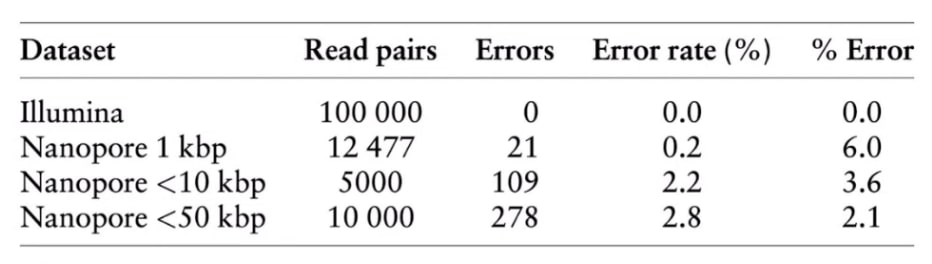

#### Performance among DNA dataset

- 橫軸解釋（不同工具與對應的演算法）
    - ours: Block Aligner（block size between 1% ~ 10%）
    - edlib: banded edit distance
    - ksw: banded affine gap（band size 1%）
    - wfa2: wavefront
    - parasail: no banded

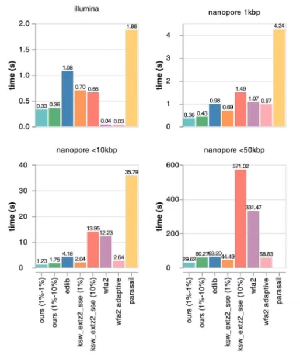

### Protein

#### Error vs. length in protein dataset

- 橫軸為 sequence 的長度
- 下圖左的 block size 固定，只有 shift 而沒有 shrink 和 growing
- 一個點代表 dataset 中的一個 pair
- 可以看出有 shrink 和 growing 能夠明顯降低錯誤率

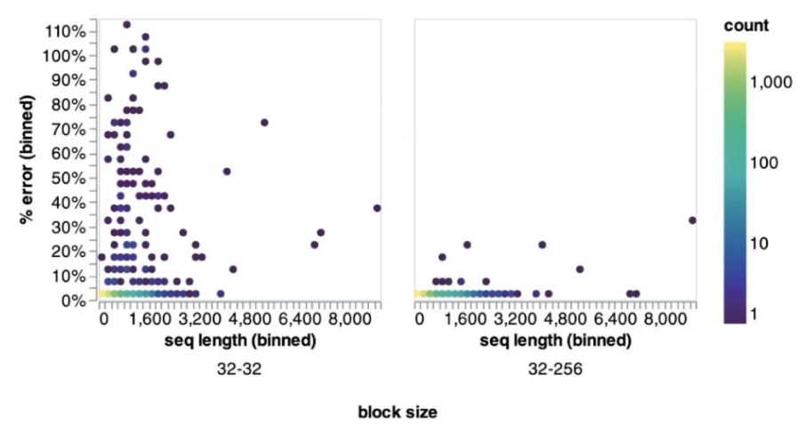

#### Error vs. seq id in protein dataset

- 橫軸為 sequence 的 identity，可以看到從 20%+ 到 90%+ 都有
- 可以看出有 shrink 和 growing 能夠明顯降低錯誤率

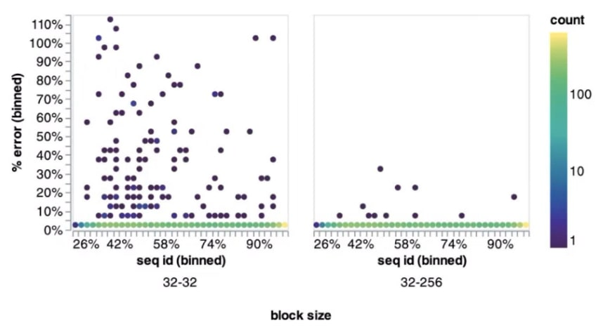

#### Performance in protein dataset

- 橫軸解釋
    - uc30: Uniclust30
    - uc30_0.95：Uniclust30 中 seq id $\ge$ 95% 的
- 同樣可以看出 shrink 和 growing 能夠降低錯誤率（上圖的藍色對黃色）
- 不過就算只加大 block size 而不使用 shrink 和 growing 也能降低錯誤率，但運算時間就會大幅增加（上圖的黃色對粉紅色）
- 由於其他工具只有 parasail 能夠處理蛋白質，因此下圖只有跟 parasail 比較，速度快了 4.8 倍左右

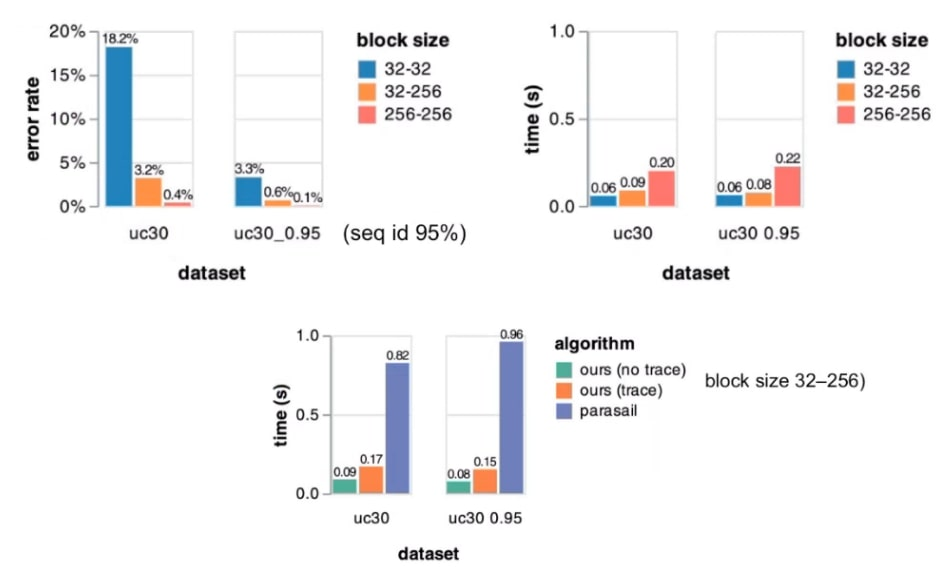

## Conclusions

- 當兩個序列有一定程度的差異，用 Block Aligner 會比 WFA 好
- Future work: SIMD
    - 能夠將 Block Aligner 運用在其他 SIMD instruction sets 上
- Future work: Block Shift
    - 目前是直接利用簡單的 greedy heuristics 判斷要往下方還是右方運算
    - 若能改成判斷走到終點的預估值可能會更加準確（複雜），如 A* algorithm
      > 可參考論文：Exact global alignment using A* with chaining seed heuristic and match pruning
- alignment 在生物資訊領域中是一個核心的部分，這篇論文提出了具有一定效率、彈性、與準確性的方法
- Block Alignment 不只能夠運用於 DNA，在 protein 中使用也有一定的準確性
